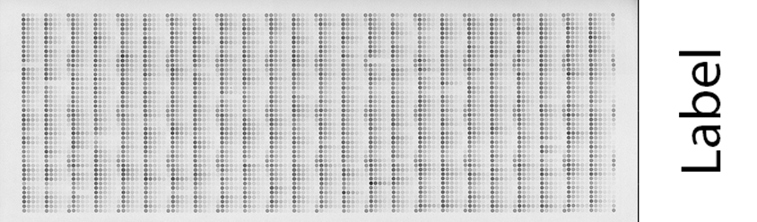
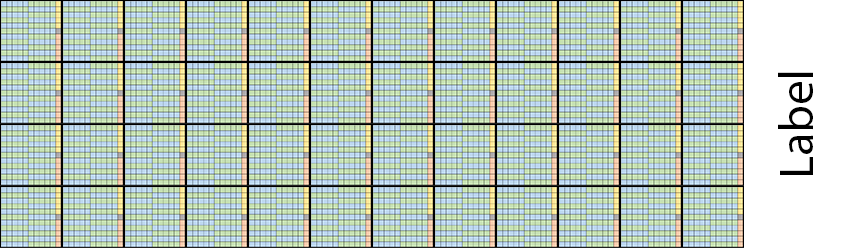
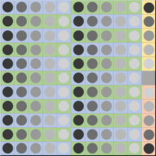
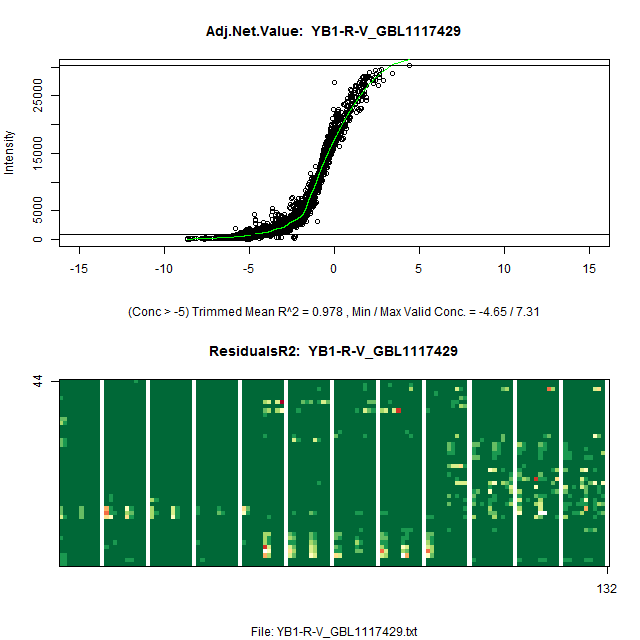
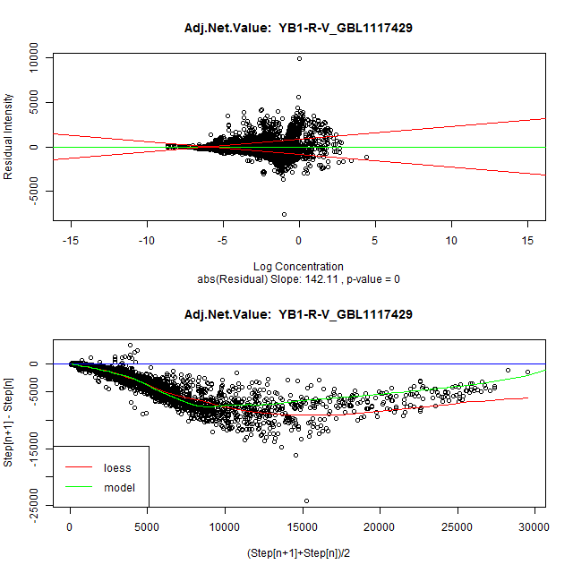

 ```{css, echo=FALSE}
    body .main-container {
      max-width: 1024px !important;
      width: 1024px !important;
    }
    body {
      max-width: 1024px !important;
    }
    h1
    {
        text-color: #f00000;
        font-size: 180%;
    }
    h1, h2, h3
    {
		text-align: center; 
        //background-color: #f5f7f7;
    }
    h2, h3
    {
      font-size: 130%;
    }
    ```


\newpage
***
# Purpose of the RPPASPACE R Package{#intro}
***
The RPPASPACE R package provides tools for the analysis of reverse-phase protein arrays (RPPAs), which are also known as "tissue lysate arrays" or simply "lysate arrays". The package's primary purpose is to input a set of quantification files representing dilution series of samples and control points taken from scanned RPPA slides and determine a relative log concentration value for each valid dilution series present in each slide and provide graphical visualization of the input and output data and their relationships. Other optional features include generation of quality control scores for judging the quality of the input data, spatial adjustment of sample points based on controls added to the slides, and various types of normalization of calculated values across a set of slides.  

***  
# An Example to Show How It Works {#example}
***
If you just want to run a sample set of slides through the software to test it out, a sample run script sample input files are included in the package.  
  
To run the test script, do the following:  

1. If on a Unix System, set your environment as explained in the "[Display Adapter Settings on Unix](#unix)"  
2. If not already installed, install a version of R greater than 2.15 (and optionally RStudio).  
3. Run R or RStudio.  
4. Install all the dependent packages used by RPPASPACE from CRAN using the command: install.packages(c("methods", "doParallel", "foreach", "parallel", "iterators", "utils", "grDevices", "graphics", "stats", "MASS", "cobs", "magrittr", "imager", "bmp", "jpeg", "tiff", "png", "boot", "mgcv", "quantreg", "robustbase", "splines", "timeDate", "knitr", "rmarkdown") If these are not available for the version of R you are using, you may need to install them from source, possibly one at a time.   
5. Install the RPPASPACE package.  (We hope to eventually make the package vailable on CRAN, but you'll need to use stand-alone package for now.)  install.packages('RPPASPACE_1.0.4.tar.gz', repos=NULL, build_vignettes = TRUE)  
6. Copy the example script and input files that are a part of the package to a directory where you wish to run the software.  The files can be found in the inst/extdata folder in the package.  
    + Make a directory for the files.  
    + Copy the img and txt directories and their contents from inst/extdata of the package to that directory.
	+ Unzip the txt.zip file into the txt directory.
    + Copy the Run.R script from the inst/extdata/sampleCode of the package to that directory.  
7. Edit the Run.R script and put the path to the directory you moved the files in step 6 above to in the example file in the line that says:  analysishome <- [Insert directory here]  
8. If you have more than one CPU core available on the machine you are using, you can allow some of the processing to run in parallel by changing the value of number_cpus_to_use in the Run.R file.   For best results without locking up your system, we'd recommend using 1 less than the maximum number of cores you have access to on that system.  
9. Run the Run.R file in the R or RStudio using the source() function.  
 

## Expected Results from the Sample Code and Data
If you are using only one CPU for processing as set up in the defaults, the processing of the sample files should probably take less than a minute.  While running the R Console window, print messages telling you what stage of the processing is currently being worked on.   For more information on these steps and the details of the processing behind them, see the section "[The RPPASPACE Process](#process)" later in this document.  

A number of windows containing graphs will pop up during the run.  One will display a chart showing the values for the sample inputs for the first slide in the set of slides being processed.  It is labeled "Net.Value Intensity vs Dilution Step". This is useful to tell if the layout and values seem to be reasonable inputs for the process.  You would expect to see values on the chart increasing in intensity from left to right similar to the sample slide output shown below.  If many of the lines do not show this pattern, then your slides may either have layout issues or just wildly varying data.  

```{r, echo=FALSE, out.width="49%", fig.cap="Net.Value Intensity vs Dilution Step and Predicted Slide Quality", fig.show='hold', fig.align='center'}
knitr::include_graphics(c("images/design_check.png","images/slide_quality.png"))
```

The second graph will display if the run of slides is utilizing the Pre-Fit Quality Control metric like the sample slides do.  This will give an indication of the expected quality of the inputs for the set of slides and an indicator of the overall number of good and bad slides in the set.  

Neither of the above two graphs are saved to disk.  While processing, two images, each with two graphs will be generated for each of the slides and saved to disk.  These will be displayed on the screen briefly while the processing occurs. For details of the contents of these graphs, see the section "[Step 6: Generate Graphical Output](#process_6)" later in this document.  

The Run.R process creates a subdirectory named "out" in the analysis directory you specified in step 7 of the previous section.  If the slide sample run ran as expected, there should be 31 output files in that out directory.  For detailed descriptions of each of those files and their formats see the section "[Outputs and Output Formats](#outputs)" later in this document.  
  
\newpage
***
# The Biology of RPPAs {#biology}
***
Reverse Phase Protein Arrays are an antibody-based technique with procedures similar to that of Western blots. RPPAs resulted from an attempt to extend the microarray approach to the measurement of proteins. A microarray is "forward-phase" in that it simultaneously measures the expression levels of many genes in one biological sample.  An RPPA is "reverse-phase" in that it simultaneously measures the expression levels of one protein in many biological samples.  

The biological samples of interest are lysed, producing a homogeneous mixture (lysate), and these lysates are printed onto an array according to a dilution series. The arrays are typically glass with a nitrocellulose membrane on one side; the lysates are printed on the nitrocellulose. 

In order to measure the protein of interest, the array is first interrogated with an antibody specific to the protein of interest (the primary antibody, typically derived from a mouse, rabbit or goat). This is allowed to bind, and loose material is washed away. The array is then interrogated with a labeled antibody (a secondary antibody, such as anti-goat immunoglobulin) which recognizes the primary antibody. This is allowed to bind, and loose material is washed away. In the most common labeling approach, the secondary antibody is linked to an enzyme, as with enzyme-linked immunosorbent assays (ELISAs). The enzyme substrate is then introduced. The enzyme reacts with its substrate, causing precipitate to build up near the site of the reaction: more of the protein of interest at a spot means more enzyme should bind and more precipitate should form. After a short period, the loose substrate is washed away. 

After drying, the array is then imaged, typically with a flatbed scanner, usually producing a TIF image file. (Ideally, the TIF file should be 16-bit grayscale. We have encountered cases where the files were exported as true color (24-bit), and then converted to grayscale afterwards. Depending on the software used, this latter step can introduce substantial distortions.) The printed spots visible in the image file are then quantified using software developed for cDNA microarrays. 

Several other methods of labeling the secondary antibody have been tried, including fluorescent dyes and quantum dots, but all methods still yield a TIF image file which is then quantified.  
  

***
# The RPPASPACE Model {#model}
***
A key distinction between reverse-phase and forward-phase assays is that for reverse-phase assays the hybridization kinetics should be the same at every spot, as all samples are being queried for the same protein. Thus, in the case of lysate arrays, we expect there to be a single common dose-response curve, instead of a separate one for each sample. In particular, we can borrow strength across samples for the estimation of baseline and saturation intensity. 

We assume that the observed intensity for sample $i$, dilution step $j$, replicate $k$ can be fit as
$$
  y_{ijk} = \alpha + \beta * g(\gamma(\delta_i + x_{ij})) + \epsilon_{ijk},
$$
where $g(x) = e^x/(1+e^x)$. 

The shape parameters of the logistic response curve, $\alpha$, $\beta$, and $\gamma$ are common for all samples. The $x_{ij}$ are known offsets from the level of interest, such as the undiluted or "neat" state. We typically use $\log_2$ units for $x_{ij}$, letting the adjustment to base $e$ be subsumed into $\gamma$. The $\delta_i$ terms represent the unknown protein concentration at the reference level for sample $i$. Finally, $\epsilon_{ijk}$ is taken to be white noise. 

We fit the above model using Nonlinear Least Squares nls iteratively, alternating between fitting the shape parameters and the sample concentrations.

Although RPPASPACE outputs relative protein concentration values it is possible to obtain an absolute concentration value if titrates with known protein concentration are included on the slide to calibrate the x-axis and map relative values to absolute values.  
  

***
# Differences between RPPASPACE and Its Predecessor, SuperCurve {#vs_supercurve}
***
The RPPASPACE R package was developed starting with the 1.5.15 version of the SuperCurve R package (see https://bioinformatics.mdanderson.org/public-software/supercurve/). 

Changes were requested that were not compatible with the existing codebase of the SuperCurve package. There was also added emphasis on making the package integrate more easily and provide additional features for a more comprehensive RPPA processing pipeline known as the RADIAN Pipeline (see http://www.radianpipeline.org/).  As a result, a new package was created that eliminated or modified some of the SuperCurve features, added multiple new features, and enhanced the performance of the package overall.  As a consequence, RPPASPACE is no longer compatible with the SuperCurve suite of products at http://r-forge.r-project.org/R/?group_id=1899.  

**Some of the differences in RPPASPACE 1.0 from its predecessor SuperCurve include:**
  
**New and/or Improved Features:**

* Added code to validate that all slides in a set have the same layout and dilution levels for each spot.  Skips processing of slide if different from the first slide in the set.
* Added option of "None" normalization method to allow processing of slides without normalization being done by the package.
* Added capability to exclude a list of dilution series from fit curve creation without requiring changes to the slide layout.
* Added option to use some or all positive control series as inputs for a "Noise" QC metric.
* Added support for additional input slide images formats. Now supports tif, png, bmp, gif or jpg.
* Added capability to rotate input slide images in 90 degree increments if the slide files do not match the orientation of the spots in the quantification files.
* Added capability to rotate the data in the ResidualsR2 graph in 90 degree increments to match the slide image orientation.
  
**Processing Improvements and package updates:**

* Added optional parallelization of some portions of the code for faster processing of slide sets.
* Removed dependence of the third-party image processing software product ImageMagick.
* Improved error handling.  Processing of slide set even if some slides fail rather than stopping on the first error.
* Improved error reporting. Outputs error and warning files as part of output with more useful error messages for reporting run-time issues.
* Made creation of combined output image optional and not done by default and changed format from jpg to png.
* Updated documentation and examples.
  
**Changes Inputs and Outputs:**

* Switched to a standard slide text input format.
* Eliminated usage of a design file.
* Removed functions related to defining design files or related parameters or designing slides without the use of quantification text files and removed alias-related functionality.
* Added output file of adjustments made to all slides in set by spatial corrections algorithms.
* Added combined QC metrics output file containing QC metrics for all QC methods used.
  
**Bug Fixes and Code Maintenance:**

* Fixed bug causing CobsFitClass to possibly return concentration data in wrong order.
* Fixed bug causing spatial correction surface creation to put points on wrong surface.
* Added additional package imports for processing: doParallel, foreach, parallel, iterators, imager, bmp, jpeg, tiff, png.
* Improved code base - removed unused portions of code in package including 8 complete source files and updated some deprecated methods in R.  Now passes as-cran R CMD check.
* Documented requirement of use of xvfb in headless Unix environments for graphics output.
  

***
# RPPASPACE Input Data {#input_data}
***
As mentioned above, the primary data for input into RPPASPACE usually comes from a multi-step process where an image of a slide has been created and quantified. Some software products used for the quantification step include Mapix, MicroVigene, or ArrayPro.  The output of this quantification software will generally be a text file that usually lists multiple fields that describe the values on the slide.  

RPPASPACE requires all slide data to be input into the system in a specific standardized format.   Conversion to this standard text file format will require custom software/scripts based on the format of the output of the configuration of quantification software used to quantify the slide image. Some examples of R scripts used to convert files from various quantification packages are included in the RPPASPACE package.  Examples can be seen later in this document in the section "Converting Slides to Standard Slide Input Format"

RPPASPACE accepts two types of input data:

* Tab-delimited text files with an extension of ".txt".  (See information on the standard slide format below.) 
* Optional slide image files in one of the following formats/extensions: ".tif", ".png", ".bmp", ".gif", or ".jpg". 
It is suggested that there only be one slide per image. If the option for creating combined output image files is utilized, the entire image will be appended to graphs created by the RPPASPACE process and output as a single png output file.  If an image for a particular slide is not available, then a "missing image" graphic file will be appended to the combined output image.

In addition to the input data, configuration objects will need to be set up to run RPPASPACE.  This configuration will be detailed in a later section.  
  
  
***
# RPPASPACE Standard Slide Input Format {#slide_input_format}
***
RPPASPACE expects each tab-delimited slide in a set to be in the following format. There should be a row for each possible spot on the slide grid mentioned above with the following columns for each row.
The file should contain a header row with the column names listed in the following table.

Column Name | R Data Type | Description
----------- | ----------- | -----------------
Order       | Integer     | Order of the points in this file.  Used for tracking/error reporting. Generally expected to be 1 through number of points on the slide.
Main.Row    | Integer     | Main grid row number
Main.Col	  | Integer | Main grid column number 
Sub.Row	    | Integer | Sub grid row number 
Sub.Col	    | Integer | Sub grid column number
Series.Id	  | Integer | 0 for Blank spots and negative controls, Integer from 1 to number of sample dilution series printed on the slide. Additional integer values for positive controls series if those are used.
Spot.Type	  | String | Case-insensitive text string describing the type of spot at this grid location. Only one spot type is allowed per spot. Acceptable values include: "Sample", "Blank", "Buffer", "NegCtrl", "PosCtrl", "PosCtrl-Noise", and "Noise". For many labs, the only values that would be likely to be needed would be "Sample" and possibly "Blank". 
Dilution	  | Double | The decimal value of the dilution, or 0 for blank areas and negative control points. Common 2-fold values would be a subset of: 100, 50, 25, 12.5, 6.25, 3.125, 1.5625, and 0.78125.
Net.Value	  | Double | The value of the spot calculated by subtracting the Background.Value from the Raw.Value	  | Raw.Value	Double | The value of the spot (usually mean value of pixels) in 16 bit value
Background.Value | Double | The value of the background around the spot (usually mean value of pixels) in 16 bit value.
Spot.X.Position | Double | Horizontal position (in pixels) of center of spot on image. Not actually used in RPPASPACE software, but can be used when debugging to help locate the spot in the original image.
Spot.Y.Position | Double | Vertical position (in pixels) of center of spot on image. Not actually used in RPPASPACE software, but can be used when debugging to help locate the spot in the original image.
Original.Order  | Numeric | The original order of the spots in the source file before conversion. This should be created by user's slide conversion script outside of RPPASPACE. (Useful for tracking back to the original quantified values if there is a problems on a slide. Not actually used by RPPASPACE for processing.)
 | | 

***
# RPPASPACE Expectations of Input Data {#expectations}
***
1)	All slide input data will be in text files in the standard slide input format specified above.  These will be referred to as the slide quantification text files in later descriptions in this document.
2)	Each slide quantification text file should contain information for only one slide.
3)	All slide quantification text files for a RPPASPACE run will be in one directory.
4)	All slide quantification text files for a RPPASPACE run will have the same slide layout. (First 8 columns of each slide in set should be identical.)
5)	The spots on each slide will be laid out in a regularly spaced rectangular grid pattern of rows and columns.  
6)	If the layout of the slide is not broken into obvious subgrids, then the Main.Row and Main.Col fields in the input file can all be set to 1 with the Sub.Row and Sub.Col representing the location in the overall grid.
7)	Each slide will consist of multiple sample dilution series, assigned a series id that is a positive integer from 1 to the number of series on the slide. 
8)	Biological or technical replicates of a series should be treated as separate series and assigned a unique series number.
9)	Series dilutions levels will have a high value of 100 and a low value greater than zero.
10)	All dilution series that are on a slide will have the same number of dilution points.
11)	All dilution series on a slide will include one and only one spot for each dilution level.
12)	If included, positive controls and their two noise variations, will also be dilution series, with the same number of points and same dilution levels as the sample series on the slide and will be assigned a series id in the same manner as the sample dilution series.
13)	Each slide may optionally have negative control points or blank spots in the grid.
14)	If negative controls are included on the slide they will all have a dilution of 0 and a series id of 0.
15)	If positive controls or noise controls are present on the slide, negative controls must also be present if spatial corrections, pre-fit QC , and/or noise calculations are to be calculated as part of the processing of the slide set.
16)	If images of the original slides are to be included in the output, all input slide images for a run must be of the same file type (with a common file extension) and stored in the same directory.  Slide file names (excluding the file extension) must match the file names of the slide input text files for the run.  Files not matching one of the slide names will be ignored.  All slide image files are optional.  These will only be used for creating a final combined output image for each processed slide.  If no image of the designated format is present for a given slide a "missing image" graphic will be included in the final combined output image.
17)	Any spot in the rectangular grid that should always be ignored during processing should be assigned a Spot.Type of "Blank" and should have a dilution of 0 and a Series.Id of 0.  
  

***
# Positive and Negative Controls {#controls}
***
RPPASPACE uses the Net.Value column of the input slide for its calculations.  As the Net.Value is expected to be the difference between the Raw.Value and the Background.Value for each spot, variations in the background of the slide can cause variations in the intensities of the spots used in the calculations. If the background were uniform, then spots with nothing, or just a buffer solution printed on them (negative controls) should have the same values across the slide. In addition, replicates of a single dilution series (positive controls) printed at various positions on the slide should also have consistent values at each dilution level.  

If such positive and negative controls are spread out in a regular fashion across a slide, the RPPASPACE package provides mechanisms for judging the quality of the slide (known as the pre-fit QC value) before doing further processing, and for adjusting the values of the sample points in a manner to correct for the regional differences in the positive control points in the region around each sample (spatial correction).

For best accuracy, it is suggested that slides utilizing the pre-fit QC calculations or spatial corrections divide the slide into rectangular subgrids and place at least one negative control and one or more positive control series in each subgrid of the slide.  
  

***
# Slide Layout Example {#layout_example}
***
In the MD Anderson RPPA Lab, slides are laid out in a regular rectangular grid consisting of 5808 spots, 132 spots in the horizontal direction and 44 spots in the vertical direction, with a label area on the right side of the slide, as seen in the figure below "Example MD Anderson Slide Image".  

```{r, echo=FALSE, out.width="90%", fig.cap="Example MD Anderson Slide Image", fig.show='hold', fig.align='center'}

```
  

The slide shown above can be subdivided into subgrids of 11 spots by 11 spots with 12 subgrids horizontally and 4 subgrids vertically as shown in the figure below "MD Anderson Slide Layout Showing Subgrids".  

```{r, echo=FALSE, out.width="90%", fig.cap="MD Anderson Slide Layout Showing Subgrids", fig.show='hold', fig.align='center'}

```
  

Subgrids can be a useful way of helping to organize the layout of the samples and control points on a slide. In SuperCurve, the subgrids could be used along with the design file to determine what order the data in the input file might be processed.  Since the input file specification in RPPASPACE utilizes a common layout, the subgrids now mainly serve as an optional method for managing the layout of an input slide.

In the standard MDA format, one subgrid would contain 11 spots horizontally by 11 spots vertically.  
  
```{r, echo=FALSE, out.width="30%", fig.cap="Example of Single Subgrid Layout", fig.show='hold', fig.align='center'}

```

In the example subgrid layout shown in the figure, "Example of Single Subgrid Layout", the backgrounds of each square are color-coded to help explain the function of each part of the subgrid.  The squares with blue and green backgrounds are 5-spot dilution series representing samples for which RPPASPACE tries to calculate the relative concentrations. Ten squares along the right side represent two copies of 5-spot positive control dilution series. The grey square on the center of the right side (11th column) is a negative control spot. 

Two-fold dilution series for samples on slides in the standard MDA format are printed horizontally with the highest concentration on the left and decreasing toward the right.  Positive and negative control spots are arranged such that within each subgrid, the first copy of the positive control series starts at the top, \ decreasing vertically.  Below the first series is a negative control spot, followed by another copy of the positive control series, starting with the lowest concentration and increasing to the highest concentration.  Points could actually be anywhere on the grid as long as they are consistent between slides in a set being processed.

Within the quantification text file representing the slide values, each spot on the slide would be represented by one row.  As described in The Spot.Type column would contain "Sample", "PosCtrl", and "NegCtrl" respectively for the samples, positive controls, and negative controls.  This pattern is repeated for each subgrid of the slide.  
  

***
# Handling of Replicated Sample Dilution Series {#replicated_series}
***
Some labs print replicated dilution series of the same samples on a single slide and combine the repeated samples in some manner, such as taking the mean of the spots for each dilution level. RPPASPACE expects all dilution series on a slide to have the same number of points and for no dilutions to be repeated within a series.  When using RPPASPACE, replicated series on the slide should be treated as separate samples with different Series.Id values. Any processing to combine the replicated series should either be done before the slide is passed to RPPASPACE to process or be combined after the RPPASPACE process has completed.  
  

***
# Support of Missing or Skipped Sample Series {#missing_series}
***
Some labs we have worked with may have a rectangular grid of spots, but may skip some series for some reason such as leaving a blank area between samples from different sources, or may know that some spots on a particular set were not valid and just want to skip processing them.  The best way to handle these skipped spots is to mark them as "Blank" in the quantification text files when converting them to the standardized format used by RPPASPACE.  This will cause the spots to not be used in calculating the concentration curve and to not plot those points on the output plots.

If you just want to skip some sample series from being used to calculate the concentration curve, but still want those samples to be plotted on the output graphs, then RPPASPACE provides a way to specify which samples to ignore when calculating the curves for the slides in the set.  Create a list of the Sample.Id values for the samples to be excluded from the curve calculations and assign that list to the seriesToIgnore parameter of the RPPADesignParameters class when configuring RPPASPACE.  
  

***
# Randomly Ordered Slides {#random_order}
***
The standard slide format used in the MD Anderson RPPA Lab prints the spots for each sample dilution series near one another so that it is easier to do a visual inspection of the slide to get an idea of how well the printing and staining process went.  This is not a requirement of the RPPASPACE software.   Spots can appear in any order in the grid as long as they are properly designated in the quantification text input file. All slides in a set must follow the same ordering.  
  

***
# The RPPASPACE Process {#process}
***
RPPASPACE processes a set of slides as follows:  
1.	[Read a set of slide quantification files from a specified directory.](#process_1)  
2.	[Perform pre-fit quality assurance checks. (optional).](#process_2)  
3.	[Perform spatial adjustments (optional).](#process_3)  
4.	[Perform curve fitting and calculate relative concentrations.](#process_4)  
5.	[Perform noise quality control calculations (optional).](#process_5)  
6.	[Generate graphical output.](#process_6)  
7.	[Slide Normalization.](#process_7)  
8.	[Write final results.](#process_8)  
  

## Read Slide Quantification Files {#process_1} 
As part of the setup process, the user supplies a directory containing the set of quantification text files representing RPPA slides. It is expected that each quantification file representing a slide is named with the name of the antibody used on the slide and an extension of ".txt".  The software gathers a list of all files in that directory with a ".txt" file extension.  The contents of the first file found will be used to determine the expected layout of all of the slides in that set.  The columns compared include Order, Main.Row, Main.Col, Sub.Row, Sub.Col, Series.Id, Spot.Type, and Dilution. Each text file that doesn't have the same values with respect to those columns will generate an error message and will not be processed by the following steps of the process.  

The name of the file, without the .txt extension, will be used as the name of the antibody/slide being processed.  Additional steps in the process will use the file name when referring to that slide when reporting errors and providing the final output.  Internally, each file will be used to construct a RPPA object and the set of all the RPPA objects to be processed will be part of an RPPASet object. 

Specification of the input directory for the quantification files is done by setting the txtdir parameter of the RPPASPACESettings object of the RPPASPACE package.

If there are issues in reading the data for a particular slide or all slides in general, then messages regarding the issues will be written to the designated error output file.  
  

## Perform Pre-Fit Quality Assurance Check {#process_2}
The RPPASPACE package includes methods to provide a quality assurance check under the following conditions:  
. The parameter doprefitqc has been set to true in the RPPASettings configuration object.  
. The appropriate positive and negative controls have been included as part of the slides.  
. The slides use 5 point dilution series.  For slides with dilution series with some other number of dilution points, the Pre-Fit Quality Assurance Step will be skipped.  

If these conditions are met, the Pre-Fit Quality Assurance (Prefit-QC) code will be run to calculate a value between 0 (bad) and 1 (good) to indicate the quality of each slide.  Typically, we treat any value below .8 as indicating a bad slide that probably needs to be reprocessed or removed from the set.  Output from this routine will be written to a file named "rppaspace_prefit_qc.csv" in the specified output directory.  

Specific details of the configuration parameters for the pre-fit QC portions of the RPPASPACE process can be found in the help for the doprefitqc and onlynormqcgood parameters of the RPPASPACESettings object of the RPPASPACE package.

The calculations are based on a number of features of the slide.  For a more technical description on the methods used by RPPASPACE to perform Quality control checks see the paper "[Development of a robust classifier for quality control of reverse-phase protein arrays](https://www.ncbi.nlm.nih.gov/pmc/articles/PMC4375399/)".

If there are issues in computing the pre-fit quality control values for a particular slide or all slides in general, then messages regarding the issues will be written to the designated warning or error output file, depending on the severity of the issue.  
  

## Perform Spatial Adjustments {#process_3}
For multiple reasons, background and foreground intensities may vary across the surface of a slide.  RPPASPACE offers a method of correcting for such variations if the slides are properly configured.  For this method to work, multiple dilution series of a common substance (known as positive controls) must be printed across the slide in a regular grid-like pattern.  If a slide did not have background and foreground variations, one would expect such replicated positive control dilution series on the slide to all have nearly identical values at each dilution level. If these values do differ, then it can be assumed that values of samples between these replicates may vary in a similar manner and can be used to adjust the values of the samples.  As background noise inherent in the slide creation process may be larger than some of the values of the spots of some lower intensities, negative controls (spots with nothing or only a buffer substance printed on the slide) are used to determine a low cutoff point at which the positive controls will be ignored when calculating the spatial corrections.

If spatial correction is requested for the run of RPPASPACE, spatial adjustments are performed on each slide individually and the values used to adjust each spot on each slide will be written to the output directory in a single file named "spatial_adjustments.tsv". The tab separated file will contain a column for each slide in the set of slides and a row for each point on the slide. Unlike the other text-based output files, the spatial corrections file will be written to disk as soon as the spatial corrections have been calculated for all slides.

If errors are generated while calculating the spatial adjustments for a slide, then later calculations such as curve fitting and graphics output will use the original data for that slide rather than the spatially corrected data for that slide. Slides that were not spatially corrected due to errors will contain a column of all 0's for those slides due to their not being adjusted for later calculations.

Specific details of the configuration parameters for the spatial corrections portions of the RPPASPACE process can be found in the help for the RPPASpatialParams object of the RPPASPACE package.

Some of the positive control series on a set of slides may be treated differently than others dependent on the Spot.Type field setting.  See the section "Perform Noise Quality Control Calculations" below for more information on this option.

For a more technical description on the methods used by RPPASPACE to perform spatial corrections, see the paper "[Spatial Normalization of Reverse Phase Protein Array Data](https://www.ncbi.nlm.nih.gov/pmc/articles/PMC4264691/)".

If there are issues in computing the spatial adjustments values for a particular slide or all slides in general, then messages regarding the issues will be written to the designated warning or error output file, dependent on the severity of the issue.  
  

## Perform Curve Fitting and Calculate Relative Concentrations {#process_4}
One of the major goals in RPPASPACE is to create a model based on the intensity values of the spots on a slide of input data and use the model to provide a computed relative concentration for each sample dilution series on the slide.  Multiple algorithms are available in RPPASPACE for creating the model of the input data including logistic, loess (Local Polynomial Regression), and COBS (a monotone increasing B-Spline).  See https://cran.r-project.org/package=cobs for technical details on the R COBS package.  RPPASPACE provides mechanisms to allow users to register other custom models using the registerModel function. 

By default, a model is created using all of the points of all of the samples on an individual slide.  As described in the introduction, the generated curve of intensity values vs log concentration values is expected to generate a curve for each slide that is sigmoidal in shape. The midpoint of the high and low intensities for each sample is calculated and are used as inputs into the model to calculate the estimated concentration for that sample along that sigmoidal curve. This is referred to as the EC50 for a sample.  The EC50 values for all slides in the set are written to a comma separated value file in the output directory named "rppaspace_conc_raw.csv". This file will have a column for each slide in the set of slides and a row for each sample.

As mentioned above, by default, all dilution series marked as samples in the input slide are used for creating the model.  RPPASPACE provides a mechanism to ignore some samples on the slides for a given set of slides when fitting the curve to the input data.  Each sample is assigned a Sample.Id in the input quantification files.  To exclude samples when constructing the model, the Sample.Ids of the samples to skip to exclude are added to a list and that list is assigned to the seriesToIgnore parameter of RPPADesignParams object.  These samples will not be used to construct the model, but will still be fit to the curve and output as they would normally be by RPPASPACE.

Specific details of the configuration parameters for the curve fitting and concentration calculation portions of the RPPASPACE process can be found in the help for the RPPADesignParams and RPPAFitParams objects of the RPPASPACE package.

For a more technical description on the methods used by RPPASPACE to perform curve fitting and the overall theory of the process, see the paper "[Non-parametric quantification of protein lysate arrays](https://academic.oup.com/bioinformatics/article/23/15/1986/205819)".

Users can also add their own curve fitting methods to the process by registering their methods with the RPPASPACE system.  See the help for the registerModel function for more information.

If there are issues in creating or fitting the curve for a particular slide or all slides in general, then messages regarding the issues will be written to the designated warning or error output file, depending on the severity of the issue.  
  

## Perform Noise Quality Control Calculations {#process_5}
If positive and negative controls are part of the slide layout, an additional QC metric, called the Noise Quality Control metric, is available for calculation.  Instead of using all of the positive control dilution series only as positive controls, some can be alternately used to calculate the new metric.  This is done by setting the Spot.Type fields in the slide quantification files for a set of slides for some of the positive control series to either Noise or PosCtrl-Noise instead of PosCtrl.  The Spot.Type designation will determine how those spots are treated when processing the slides.

The dilution series is treated as follows, depending on the Spot.Type chosen for that dilution series.

**Spot.Type = PosCtrl**

* Will be used in Pre-fit QC Metric calculations.
* Will be used in spatial correction calculations.
* Spatial Correction results will not be applied to these points.
* Will not be used to calculate the curve for the slide.
* Will not be fit to the curve for the slide nor used in the Noise QC metric.

**Spot.Type = PosCtrl-Noise**

* Will be used in Pre-fit QC Metric calculations.
* Will be used in spatial correction calculations.
* Spatial Correction results will be applied to these points.
* Will not be used to calculate the curve for the slide.
* Will be fit to the curve for the slide used in the Noise QC metric.

**Spot.Type = Noise**

* Will be used in Pre-fit QC Metric calculations.
* Will not be used in spatial correction calculations.
* Spatial Correction results will be applied to these points.
* Will not be used to calculate the curve for the slide.
* Will be fit to the curve for the slide and used in the Noise QC metric.

If any of the dilution series in a slide file are marked as either Noise or PosCtrl-Noise, then the Noise QC metric will be calculated for the set of slides and written to the files "rppaspace_noise.csv" and "rppaspace_combined_qc.csv" in the output directory.  

The dilution series designated as Noise or PosCtrl-Noise series will be treated similarly to the sample points on the slide.  They will be used calculate a logistic curve for all of the Noise series.  Slopes between consecutive points of the noise dilution series along that curve will be calculated and any slopes below 0.001 will not be used later noise calculations.  For the remaining points, concentrations for the noise dilution series are estimated using the same curve generated for the sample points on the slide as described in the previous section "Perform Curve Fitting and Calculate Relative Concentrations".  The calculated concentration values are output as the Noise QC metric values for these dilution series and are also plotted on the plots described in the section "Generate Graphical Output".

If there are issues in calculating the noise statistics for a particular slide or all slides in general, then messages regarding the issues will be written to the designated warning or error output file, depending on the severity of the issue.  
  

## Generate Graphical Output {#process_6}
For each slide that was successfully processed by RPPASPACE, two graphics files are created in the output directory that each contain two plots. 
The two png files output for the slide will be named with a prefix of "rppaspace_" followed by the antibody name for the corresponding slide followed by "_1.png" or "_2.png". Each contain two plots, as shown in figures below, "Sample PNG #1" and "Sample PNG #2".

<center>

  

</center>  
  
Sample PNG # 1 consists of two graphs. The top graph is a 2 dimension points plot of the input intensities (modified by spatial adjustments, if appropriate) along the y axis and the calculated log 2 concentrations along the x axis.  The green line displays the curve modeled by the selected curve fitting method.  The second graph provides a geographic plot of some measure computed from the fit.  The default is to image the (raw) residuals, with options for other forms of the residuals or for the fitted concentrations (X) or intensities (Y).  Residuals options include residuals ("Residuals"), standardized residuals ("StdRes"), r2 residuals ("ResidualsR2"), fitted x ("X"), and fitted y ("Y").  In this plot there is one square for each point on the slide. Blocks are dark green where residuals are near zero.  The solid white columns in Figure 4 above represent the positive and negative control points on the slide.

<center>  

  
  
</center>  
  
Sample PNG # 2 also consists of two graphs.  The top graph is a plot of the residuals vs. estimated concentration and can be used to check for heteroscedasticity.  A model of absolute residual values vs. estimated concentration is created to assist in doing a rough check for increasing heteroscedasticity and is displayed as red lines on the graph.  A green horizontal line is drawn through the center of the model points.  The second graph displays a plot for each sample of the difference between adjacent points in a sample dilution versus the average of those two points. Plots of the loess (in red) and selected model (in green), in this example the using the COBS curve fitting method, over the same data are displayed to assist in determining how well the respective models fit the sample data.

If a combined output image file is requested, then a png file will also be created for each slide that will be a combination of the two png files and a scaled down version of the original slide image file, if one is provided. The software will search for images in the directory specified by the user in the imgdir parameter of the RPPASPACESettings object specified by the user when running RPPASPACE. The software will search for image files with the extension as specified in the imageextension parameter of the same object.  If no imageextension parameter is provided then the software will default to searching for files with the extension ".tif".  Supported file types and extensions include ".tif", ".png", ".bmp", ".gif", and ".jpg". All image files for a set of slides must be of the same image type with the specified file extension.  The portion of the file name without the file extension will be compared to the antibody names from the input quantification files.   Where there is not an exact match of the file name with the expected image extension, then a default image labeled "missing slide image" will be shown where the scaled slide image would normally appear in the combined output image file.   The combined output image file will be named with the antibody name of the input slide quantification file.
If there are issues in generating graphics for a particular slide or all slides in general, then messages regarding the issues will be written to the designated warning or error output file, depending on the severity of the issue.  
  
\newpage
## Slide Normalization {#process_7}
RPPASPACE inherits the functionality of the SuperCurve package for normalizing slides for slide-to-slide quantification differences across a set of slides.  The RPPASPACE package requires the user to select a normalization method and will output normalized slide data based on the method selected.  A text file with a name formatted as rppaspace_[normalization method] will be written to the output directory.

RPPASPACE is designed to support the following normalization methods:
Median Polish (medpolish), Median (median), Housekeeping (house), Variable Slope (vs), and None (none)

Method  | Description
------- | -----------
Median Polish | Fits additive model using Tukey's median polish.
Median | Sample median is subtracted from each sample.
Housekeeping | Median of set of housekeeping antibodies is subtracted from each sample.
Variable Slope | Sample median is subtracted from each sample after applying multiplicative gamma. For a more technical description on variable slope normalization, see the paper ["Variable Slope Normalization of Reverse Phase Protein Arrays"](http://dx.doi.org/10.1093/bioinformatics/btp174)
None | RPPASPACE was designed to work better with the new RADIAN pipeline being created at MD Anderson for processing RPPA sets. This pipeline has its own methods of slide normalization, so preforming extra calculations within RPPASPACE would not provide additional benefit but would take additional time. As a result, an additional method of "none" was added to the existing normalization methods to skip doing extra calculations as part of the RPPASPACE process.
 |   
  
Users can also add their own normalization methods to the process by registering their methods with the RPPASPACE system.  See the help for the registerNormalizationMethod function for more information.

If there are issues in slide normalization for a particular slide or all slides in general, then messages regarding the issues will be written to the designated warning or error output file, depending on the severity of the issue.  
  

## Write Final Results {#process_8}
Multiple text files representing the results of the previous steps are written to the output directory after the graphics output step is complete.  For more information on the specifics of the output files, see the individual sections above and the section on "[Outputs and Output Formats](#outputs)" below.

If there are issues in outputting the results for a particular slide or all slides in general for any of these output files, then messages regarding the issues will be written to the designated warning or error output file, depending on the severity of the issue.  
  
***
# Using RPPASPACE {#using_rppaspace}
***
Using RPPASPACE consists of a few steps: setting up your R environment with the prerequisite packages, formatting and organizing your input data, creating a Settings object to tell where to find and how to process your input data and where outputs should be written, and calling the fitCurveAndSummarizeFromSettings function in RPPASPACE to start the process.  
  

***
# Setting Up Your R Environment {#r_env}
***
As described in the RPPASPACE package description file, RPPASPACE requires an R version greater than or equal to 2.5 and utilizes the following packages:  
**Requires**: methods, doParallel, foreach, parallel, iterators  
**Imports**: utils, grDevices, graphics, stats, MASS, cobs, magrittr, imager, bmp, jpeg, tiff, png  
**Suggests**: boot, mgcv, quantreg, robustbase, splines, timeDate

It is best to have all of the above packages installed on your system before trying to use RPPASPACE.  
  

***
# Organizing and Formatting Of Input Data {#formatting_inputs}
***
As mentioned in earlier sections, RPPASPACE inputs two types of data, slide quantification files and optionally, slide image files for each slide. RPPASPACE processes slides in a slide set.  A slide set consists of one or more slide quantification text files and optional associated image files.  It is expected that all slide quantification files for a given set will reside in a single directory.  Also, all images for a specific set will reside in a single directory.  File names for both images and quantification files, minus the final file extensions, must be identical for the image file to be matched with a corresponding slide.

Details on the expected input file formats supported can be found in the sections above labelled "[RPPASPACE Input Data](#input_data)", "[RPPASPACE Standard Slide Input Format](#slide_input_format)", and "[RPPASPACE Expectations of Input Data](#expectations)".  A sample R script for converting data from an ARRAYPRO (used at MD Anderson) input formats can be found in the inst/sampleCode directory of the RPPASPACE package.  See section "[Converting Slides To Standard Slide Input Format](#converting)" for additional information on how to convert your lab's slides for use in RPPASPACE.  
  

***
# Creating an RPPASPACESettings Object {#settings}
***
The RPPASPACESettings object is part of the RPPASPACE package.  It is used to define directory paths and image file type specifiers for input data, directory paths and file names for output data, and parameters containing other RPPASPACE objects that specify which features of the package are to be used in processing the data. 

See the package help for full details on this object and the defaults for the calling parameters as well as specifics of the other objects provided by the RPPASPACE package used by the RPPASPACESettings object.  These include RPPADesignParams, OptionalRPPASpatialParams, RPPAFitParams, and RPPANormalizationParams objects.  
  

***
# Example RPPASPACE Script {#example_script}
***
Note: a copy of the following script file, with some additional minor output but with fewer comments, exists in the inst/sampleCode directory of the package as Run.R.

```{r eval=FALSE, echo=TRUE}
#Define the names of the files that will be written to the output directory for warnings and errors 
warningsFileName <- "warnings.txt"
errorsFileName <- "errors.txt"

#Note: Assuming a home directory (analysishome) with the following subdirectories:
#	txt (containing quantification text files),
#	tif (containing original tif images of slides)
#	out (directory for RPPASPACE output files)
#			out will be created if it doesn't exist and a warning issued if it already exists.

analysishome <- [Insert directory here]

## Pathnames (preferred layout)
txtdir <- file.path(analysishome, "txt" )
imgdir <- file.path(analysishome, "tif" )
outdir <- file.path(analysishome, "out")
number_cpus_to_use <- 2

#Create the output directory and set the working directory to it
dir.create(outdir)
setwd(outdir)

if (!dev.interactive()) { options(device="x11") }
print("===========================================================")
print(paste("Starting RPPASPACE run in ", analysishome))

Set up RPPASPACE objects to be used in creating RPPASPACESettings object
designparams <- RPPADesignParams(center=FALSE,
								 seriesToIgnore=list()
								 )
spatialparams <- RPPASpatialParams(cutoff=0.8,
								   k=100,
								   gamma=0.1,
								   plotSurface=FALSE)
fitparams <- RPPAFitParams(measure="Net.Value",
						   method="nls",
						   model="cobs",
						   trim=2,
						   ci=FALSE,
						   ignoreNegative=FALSE,
						   warnLevel=-1
						   )

normparams <- RPPANormalizationParams(method="none")	

## Create RPPASPACESettings object
settings <- RPPASPACESettings(txtdir=txtdir,
							   imgdir=imgdir,
							   outdir=outdir,
							   designparams=designparams,
							   spatialparams=spatialparams,
							   doprefitqc=TRUE,
							   fitparams=fitparams,
							   normparams=normparams,
							   onlynormqcgood=FALSE,
							   imageextension=".jpg",
							   warningsFileName=warningsFileName,
							   parallelClusterSize=as.integer(number_cpus_to_use))

#Write a copy of the settings object to the output directory so you can record what was requested.
write.summary(settings)

## Process slides
tryCatch({
	#Check that the required packages are loaded
	sapply(RPPASPACE:::getPrerequisitePackages(settings),
		   function(pkgname) {
			   do.call("library", list(package=pkgname))
		   })
	
	#Run RPPASPACE processes as detailed by RPPASPACE Settings object and write output
	fitCurveAndSummarizeFromSettings(settings)
},
error=function(cond) {
	#Display errors and messages in the R console
	message("###stacktrace###")
	dump.frames()
	invisible(sapply(names(last.dump),
					 function(acall) {
						 message(paste("   ", acall))
					 },
					 USE.NAMES=TRUE))
	message("<<<ERROR>>>", cond)
})
#Turn off the graphics windows so the program can properly close
graphics.off()
```  
  

***
# Outputs and Output Formats {#outputs}
***
All outputs of RPPASPACE will be created in the specified output directory.  If no errors occur during processing, then the following output files would be expected in the output directory:

## For each successfully processed slide
Two png plot files.  See section labelled "Generate Graphical Output" for details of these images.  

If combined output images were requested by setting the parameter createcombinedoutputimage=TRUE in the RPPASPACESettings object, then one png file combining the two png files above and the original slide image file (or "missing slide" equivalent image provided by RPPASPACE package).

## One instance per slide set

File name | Description
--------- | -----------
rppaspace_summary.tsv | File specifying status of major portions of codebase run for each slide.<br> **Format:** tab delimited text file.<br> **Rows:** 1 per slide. **Label:** name of quantification text file.<br> **Columns:** "input","prefitqc","spatial","fit"<br> **Values:** TRUE or FALSE if the specific slide was processed by the section of code represented by the header.<br>
rppaspace_conc_raw.csv |	Output of estimated concentrations of each sample series on each slide.<br> **Format:** comma delimited text file.<br> **Rows:** 1 per sample present on a slide.<br> **Columns:** 1 per slide using antibody name from name of input text file.<br> **Values:** EC50 log2 estimated concentration value for that sample.
rppaspace_conc_norm_ [normalization method].csv | rppaspace_conc_raw.csv normalized across a set of slides using the requested normalization method.  (Above example would have file name of "rppaspace_conc_norm_none.csv" and would contain the same values as " rppaspace_conc_raw.csv".)<br> **Format:** comma delimited text file.<br> **Rows:** 1 per sample present on a slide.<br> **Columns:** 1 per slide using antibody name from name of input text file.<br> **Values:** normalized version of rppaspace_conc_raw.csv  
rppaspace_ss_ratio.csv | R^2 statistics for each slide. i.e. the fraction of variance explained for each series.<br> **Format:** comma delimited text file.<br> **Rows:** 1 per sample present on a slide.<br> **Columns:** 1 per slide using antibody name from name of input text file.<br> **Values:** R^2 statistic
rs-settings.txt | Copy of the settings requested for the run.<br> Useful for review of what parameters were used in the particular software run.<br> **Format:** text file output of RPPASettings object.
parallel.log | Code output during parallel code portions (spatial adjustments and curve fitting).<br> Useful for debugging if errors occur during run.<br> **Format:** Multiple lines of text.  
rs-rppaset.RData | RData file containing the RPPASet objects at the end of processing.<br> Useful for debugging if errors occur during run.<br> **Format:** RData File
 |   

## Warnings and errors output files
(only present if appropriate level error occurred) 

File name | Description
--------- | -----------
warnings.txt | List of warnings messages output during processing.<br> File name can be specified by user.<br> **Format:** Multiple lines of text.
errors.txt | List of error messages output during processing.<br> File name can be specified by user.<br> **Format:** Multiple lines of text.
 |   

## Optional files based on settings object

File name | Description
--------- | -----------
spatial_adjustments.tsv | If spatial adjustments were requested, a file specifying the adjustments done to each point by the spatial adjustments process.<br> **Format:** tab delimited text file.<br> **Rows:** One for each spot on the slide. (Samples and controls)<br> **Columns:** One per slide.<br> **Values:** Calculated spatial adjustment for that spot.
rppaspace_prefit_qc.csv | Calculated Pre-fit QC score for each slide where one was calculated.<br> **Format:** comma delimited text file.<br> **Rows:** 1 row for each slide in the set.<br> **Columns:** row number, antibody from name of input slide quantification file, "Probabilities"<br> **Probability Values:**Value between 0 and 1 indicating the calculated probability of the slide being valid.
rppaspace_noise.csv | If positive control series on the slide quantification files were specified as Noise or PosCtrl-Noise then noise quality control statistics will be written to this file for each successfully processed slide.<br> **Format:** comma delimited text file.<br> **Rows:** 1 row for each slide in the set.<br> **Columns:** antibody from name of input slide quantification file, noise_sd, noise_mean, noise_cv, noise_n<br>  **Values:** text string with antibody, standard deviation of noise points, mean of noise points, cv of noise points, number of points used in calculations. (This last value should be constant for all slides in the set.)
rppaspace_combined_qc.csv | A file combining all various QC scores for all slides in the set, regardless of if calculation were successful or not.  Currently could contain Pre-Fit QC and Noise QC scores, if requested).  If a particular score was not calculated for a given slide then that score will be assigned an NA value.<br> **Format:** comma delimited text file.<br> **Rows:** 1 row for each slide in the set.<br> **Columns:** antibody from name of input slide quantification file, one column for each QC value calculated for set of slides. See columns and values in rppaspace_prefit_qc.csv and rppaspace_noise.csv above for specific info on columns that could be present and their values.<br> **Values:**  Calculated QC value or NA[s] if specific QC value not calculated for that slide.  
 |   
  

***
# Error and Message Handling {#errors}
***
If all required packages needed by RPPASPACE are installed, the environment is set up correctly, and the slide text files have been properly formatted, it is expected that no errors encountered during the RPPASPACE process should cause the immediate termination of the software.  All errors that occur in the package when running a script similar to the sample script in this document would cause the processing of the a particular slide to cease for a particular step of the process and an appropriate error message should be written to the specified error output file.

Error messages should, in general, describe what went wrong in human readable terms and, if possible, will be accompanied with the slide number and antibody name that was being processed at the time of the error.   Errors in one slide should not affect the processing of other slides in the set.   

Slides that could not be processed due to errors will often not be part of the output files of the process steps that failed or later processes.   It is the user's responsibility to check the contents of the rppaspace_summary.tsv, errors.txt, and warnings.txt (or equivalent files) before assuming the outputs for any given slide are present in the outputs files.  In addition to error messages, slides that had issues in particular steps of the process that kept the system from completing those steps of the process should have FALSE entries in the "rppaspace_summary.tsv" output file for each step of the process that was not completed for that slide.  
  

***
# Converting Slides to Standard Slide Input Format {#converting}
***
A sample R script for converting slides in an ArrayPro slide quantification text format into the standard RPPASPACE format is provided in the package in the inst\\sampleCode directory as convert_mda_arraypro.R.  The major challenges for converting other formats will depend on the initial data formats.  We've assisted other labs in converting their data.  Issues we've encountered included there being one column with both the antibody name and the dilution that need to be separate columns, skipped dilution series where the series skipped varied on each set of slides, dilution series for individual samples being distributed across the slide in a random fashion for each slide set, and slides having up to 4 duplicate dilution series for each sample on a slide.  All of these required custom code which made the conversion process more complicated and need to be handled on a case by case basis.  
  

***
# Display Adapter Settings on Unix {#unix}
***
For the package to be able to generate the output graphics, a graphics device must be available to the software.  On Unix systems, this requires providing a usable X11 device for the software to use.   In some cases this may require running the Xvfb application and setting up an environment variable to initialize the display.  For a Docker based instance of the package that was set up for the RADIAN pipeline which was running on a Fedora RedHat Linux installation, before using the package, we found we needed to set the following environment variable to enable the display adapter.  If you will be using the package offline in a headless environment, you may need to do something similar.  
  
Before running R, set up a display console using the following command:  
  
Xvfb :0 -screen 0 1024x768x24 &  
  
You may be able to then set an environment variable to use that display by using the following command:  
  
env DISPLAY=:0.0  
  
Start R, then check if the env command worked as expected using the following command:  
  
Sys.getenv("DISPLAY")  
  
If that does not return ":0.0" then you should be able to get it to work using a similar command within R:  
  
Sys.setenv("DISPLAY"=":0.0")  
  
In addition to this, within R, as shown in the sample script above, you will need to set the X11 options to enable the package to work in a non-interactive Unix session.  
if (!dev.interactive()) { options(device="x11") }
  

***
# References {#references}
***
Hu, J., He, X., Baggerly, K., Coombes, K., Hennessy, B., & Mills, G. (2007).  
"Non-parametric Quantification of Protein Lysate Arrays."
Bioinformatics 23 (15), 1986-1994.  
[doi:10.1093/bioinformatics/btm283](https://academic.oup.com/bioinformatics/article/23/15/1986/205819)  
  
Neeley, S., Kornblau, S., Coombes, K., & Baggerly, K. (2009).  
"Variable Slope Normalization of Reverse Phase Protein Arrays"
Bioinformatics 25 (11), 1384-1389.  
[doi:10.1093/bioinformatics/btp174](https://academic.oup.com/bioinformatics/article/25/11/1384/331482)   
  
Neeley, S., Baggerly, K., & Kornblau, S. (2010).  
"Surface Adjustment of Reverse Phase Protein Arrays Using Positive Control Spots"
Cancer Informatics 11, 77-86.  
[doi:10.4137/cin.s9055](https://journals.sagepub.com/doi/10.4137/CIN.S9055)  
  
Ju, Z., Liu, W., Roebuck, P., Siwak, D., Zhang, N., Lu, Y., Davies, M., Akbani, R., Weinstein, J., Mills, G., & Coombes, K. (2015).  
"Development of a Robust Classifier for Quality Control of Reverse-Phase Protein Arrays"  
Bioinformatics 31 (6), 912-918.  
[doi:10.1093/bioinformatics/btu736](https://academic.oup.com/bioinformatics/article/31/6/912/214854)  
